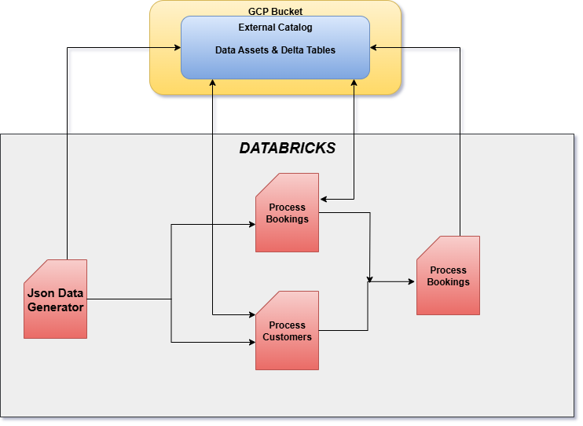

# Customer Car Booking Data Processing Pipeline

### End-to-End PySpark + Databricks Parameterized Workflow with Delta Tables & GCP Integration (External Catalog)

### Project Description

The Car Data Processing Pipeline is a scalable data engineering solution built on Databricks, leveraging PySpark and Delta Lake and GCP to process daily data of car bookings and customer information.
The project automates data ingestion, cleaning, transformation, and merging from raw JSON files stored in Google Cloud Storage (GCS) into Delta tables, ensuring reliable and queryable data for downstream analytics.

In this project I've created a **databricks external catalog** in **GCP Bucket** where i am storing all my data assets such as the json files as well as the delta tables.

## Technologies Used

- **Data Processing**	     -           PySpark
- **Orchestration**	        -       Databricks Jobs
- **Storage**	             -   Google Cloud Storage (GCS)
- **Data Format**	          -        Delta Lake
- **Catalog**	             -  Databricks External Catalog
- **Language**	            -          Python
- **Environment**	           -    Databricks Notebook

## Notebooks

There are in total 4 notebooks that automate this entire project 
 - [json_Data_gen.py](json_Data_gen.py)
 - [process_car_boo.py](process_car_boo.py)
 - [process_car_customer.py](process_car_customer.py)
 - [Merge.py](Merge.py)

#### 1. json_Data_gen.py

**The json_data_gen.py file takes date as input since it is a parameterized workflow and produces 2 files like customers_yyyymmdd and bookings_yyyymmdd in the external catalog.**

The customer details format is as such

The bookings detail format is as such

The databricks structure looks as such

Inside volumes I have 2 directories booking and customer where the json data is generated to. You can also see the 3 delta tables (2 staging + 1 merge table ) under tables.

#### 2. process_car_boo.py & process_car_customer

These 2 notebooks simultaneously ingest the json data from GCP Bucket and performs data cleaning and validation as well as transformation. Then load the cleaned data into 2 different intermediate delta tables.
Both notebooks are **parameterized**, parameter is set at job level not task level.
The 2 delta tables are:
 - **cus_book_external`.default.bookings_delta**
 - **cus_book_external`.default.customers_delta**

#### 3. Merge.py

This notebook performs the final merge operation taking data from both staging delta tables using a join first then merging into target table from the joined source.

- Reads from staging Delta tables.

- Join both Delta tables

- Merges into target Delta tables using:

- Update: If record exists, update it.

- Insert: If record doesn’t exist, insert it.

- Delete: If booking status = cancelled, remove it.

- Writes final data to target Delta tables (**cus_book_external`.default.merge_delta**) for analytics.

The final workflow looks like :

For compute i used  a 

## Conclusion

This project demonstrates a modular, parameterized data pipeline built on Databricks and PySpark, capable of handling daily ingestion, transformation, and Delta-based data merging for Car’s booking and customer datasets — ensuring clean, consistent, and up-to-date analytical data in the data lakehouse.

BY RAHUL MONDAL
[LINKEDIN](https://www.linkedin.com/in/rahul-mondal08/)
EMAIL - mondal.rahul1999@gmail.com

